# Tracker

## 
Оглавление

<ul>
<li><a href="#01">Описание проекта</a></li>
<li><a href="#02">Стек технологий</a></li>
<li><a href="#03">Требования к окружению</a></li>
<li><a href="#04">Сборка и запуск проекта</a>
    <ol type="1">
        <li><a href="#0401">Сборка проекта</a></li>
        <li><a href="#0402">Запуск проекта</a></li>
    </ol>
</li>
<li><a href="#05">Взаимодействие с приложением</a>
    <ol  type="1">
        <li><a href="#0501">Создание заявки</a></li>
        <li><a href="#0502">Просмотр списка заявок</a></li>
        <li><a href="#0503">Редактирование заявки</a></li>
        <li><a href="#0504">Удаление заявки</a></li>
        <li><a href="#0505">Поиск заявки по id</a></li>
        <li><a href="#0506">Поиск заявки по наименованию</a></li>
        <li><a href="#0507">Выход из приложения</a></li>
    </ol>
</li>
<li><a href="#contacts">Контакты</a></li>
</ul>

## 
Описание проекта

Консольное приложение для хранения заявок.
Возможна работа с СУБД PosgreSQL для хранения заявок, как с помощью
JDBC, так и с использованием Hibernate.

Функционал:

* Создание заявок.
* Просмотр всего списка заявок.
* Редактирование заявки.
* Удаление заявки.
* Поиск заявки по id.
* Поиск заявки по имени.

<a href="#contents">К оглавлению</a>

## 
Стек технологий

- Java 17
- JUnit 4
- PostgreSQL 14, Hibernate 5.4
- Maven 3.8

  Инструменты:

- Javadoc, JaCoCo, Checkstyle

<a href="#contents">К оглавлению</a>

## 
Требования к окружению

Java 17, Maven 3.8, PostgreSQL 14 

<a href="#contents">К оглавлению</a>

## 
Сборка и запуск проекта

### 
1. Сборка проекта

Команда для сборки в jar:

`mvn clean package -DskipTests`

<a href="#contents">К оглавлению</a>

### 
2. Запуск проекта

Перед запуском проекта необходимо создать базу данных todo
в PostgreSQL, команда для создания базы данных:

`create database tracker;`

Средство миграции Liquibase автоматически создаст структуру
базы данных и наполнит ее предустановленными данными.
Команда для запуска приложения:

`java -jar target/tracker.jar`

<a href="#contents">К оглавлению</a>

## 
Взаимодействие с приложением

### 
1. Создание заявки

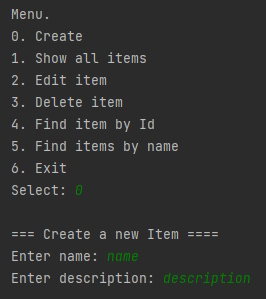

<a href="#contents">К оглавлению</a>

### 
2. Просмотр списка заявок

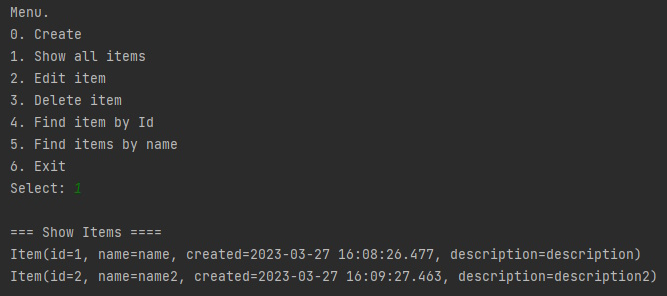

<a href="#contents">К оглавлению</a>

### 
3. Редактирование заявки

При редактировании, если id заявки указан неверно, будет выведено сообщение
о невозможности отредактировать заявку.

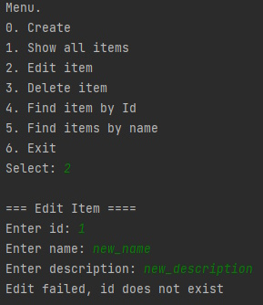

Если заявка существует, она будет сохранена с новыми значениями
полей name и description.

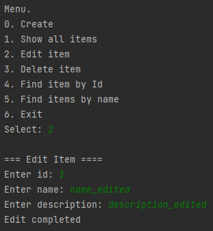

<a href="#contents">К оглавлению</a>

### 
4. Удаление заявки

Удаление заявки производится по id, если заявка с указанным 
id не найдена, выводится сообщение о невозможности удаления.

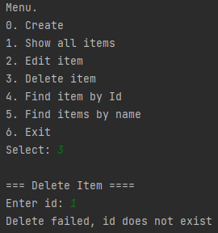

Если найдена, производится удаление заявки.

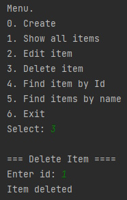

<a href="#contents">К оглавлению</a>

### 
5. Поиск заявки по id

Если заявка с указанным id не найдена, будет выведено сообщение об отсутствии 
заявки с указанным id.

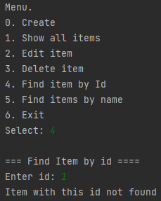

Если заявка существует, в консоль будет выведено её содержание.

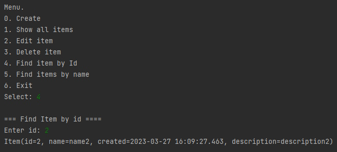

<a href="#contents">К оглавлению</a>

### 
6. Поиск заявки по наименованию

Если заявка с указанным name не найдена, будет выведено сообщение об отсутствии
заявки с указанным name.

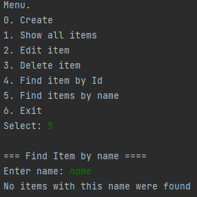

Если заявка существует, будет выведено её содержание.

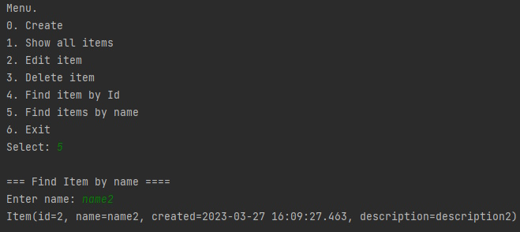

<a href="#contents">К оглавлению</a>

### 
7. Выход из приложения

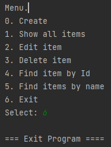

<a href="#contents">К оглавлению</a>

## 
Контакты

&nbsp;&nbsp;
&nbsp;&nbsp;

<a href="#contents">К оглавлению</a>
